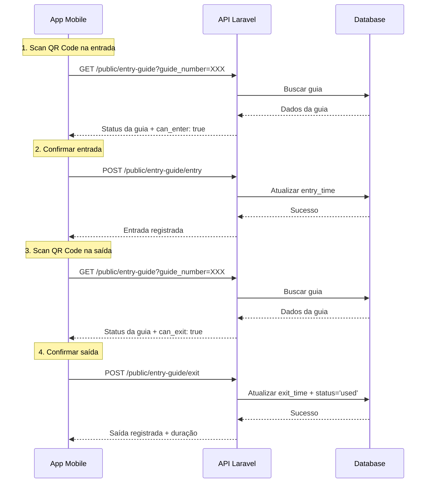

# API Entry Guide - Controle de Entrada e Saída

Esta documentação descreve os endpoints para controle de entrada e saída de visitantes usando guias de entrada via QR Code.

## Base URL

```
https://seu-dominio.com/api
```

## Autenticação

### Endpoints Protegidos
Requerem token de autenticação no header:
```
Authorization: Bearer {seu-token-aqui}
```

### Endpoints Públicos
Disponíveis para porteiros/seguranças sem necessidade de autenticação.

---

## Endpoints

### 1. Buscar Guia por Número

Obtém informações de uma guia pelo número (obtido via QR Code).

**Endpoint Protegido:** `GET /entry-guide?guide_number={numero}`  
**Endpoint Público:** `GET /public/entry-guide?guide_number={numero}`

**Parâmetros Query:**
```
guide_number: string (required) - Número da guia obtido do QR Code
```

**Exemplo de Requisição:**
```bash
# Com autenticação
curl -X GET "https://seu-dominio.com/api/entry-guide?guide_number=GE202412160001" \
     -H "Authorization: Bearer {token}" \
     -H "Accept: application/json"

# Sem autenticação (público)
curl -X GET "https://seu-dominio.com/api/public/entry-guide?guide_number=GE202412160001" \
     -H "Accept: application/json"
```

**Resposta de Sucesso (200):**
```json
{
    "success": true,
    "data": {
        "guide": {
            "id": 1,
            "guide_number": "GE202412160001",
            "guest_name": "João Silva",
            "guest_document": "123.456.789-00",
            "guest_phone": "(11) 99999-9999",
            "guest_email": "joao@example.com",
            "host_name": "Maria Santos",
            "host_unit": "Apto 101",
            "purpose": "Visita familiar",
            "destination": {
                "id": 1,
                "name": "Bloco A"
            },
            "valid_from": "15/12/2024 08:00",
            "valid_until": "15/12/2024 18:00",
            "entry_time": null,
            "exit_time": null,
            "status": "active",
            "status_label": "Ativa",
            "is_valid": true,
            "is_expired": false,
            "observations": null,
            "created_at": "15/12/2024 07:30"
        },
        "status_info": {
            "status": "valid",
            "message": "Guia válida para entrada",
            "can_enter": true,
            "can_exit": false
        },
        "can_enter": true,
        "can_exit": false
    }
}
```

**Possíveis Status da Guia:**
- `valid`: Guia válida para entrada
- `entered`: Visitante já fez entrada, pode fazer saída
- `expired`: Guia expirou
- `not_valid_yet`: Guia ainda não é válida
- `cancelled`: Guia foi cancelada
- `used`: Guia já foi utilizada (entrada e saída concluídas)

**Resposta de Erro (404):**
```json
{
    "success": false,
    "message": "Guia não encontrada"
}
```

### 2. Registrar Entrada

Registra a entrada de um visitante.

**Endpoint Protegido:** `POST /entry-guide/entry`  
**Endpoint Público:** `POST /public/entry-guide/entry`

**Parâmetros:**
```json
{
    "guide_number": "string (required)",
    "location_lat": "number (optional)",
    "location_lng": "number (optional)",
    "notes": "string (optional, max:500)"
}
```

**Exemplo de Requisição:**
```bash
curl -X POST "https://seu-dominio.com/api/public/entry-guide/entry" \
     -H "Content-Type: application/json" \
     -H "Accept: application/json" \
     -d '{
       "guide_number": "GE202412160001",
       "location_lat": -23.550520,
       "location_lng": -46.633309,
       "notes": "Visitante chegou pontualmente"
     }'
```

**Resposta de Sucesso (200):**
```json
{
    "success": true,
    "message": "Entrada registrada com sucesso",
    "data": {
        "guide_number": "GE202412160001",
        "guest_name": "João Silva",
        "entry_time": "15/12/2024 09:15:30",
        "destination": "Bloco A"
    }
}
```

**Resposta de Erro (422):**
```json
{
    "success": false,
    "message": "Guia expirou em 15/12/2024 18:00"
}
```

### 3. Registrar Saída

Registra a saída de um visitante e marca a guia como utilizada.

**Endpoint Protegido:** `POST /entry-guide/exit`  
**Endpoint Público:** `POST /public/entry-guide/exit`

**Parâmetros:**
```json
{
    "guide_number": "string (required)",
    "location_lat": "number (optional)",
    "location_lng": "number (optional)",
    "notes": "string (optional, max:500)"
}
```

**Exemplo de Requisição:**
```bash
curl -X POST "https://seu-dominio.com/api/public/entry-guide/exit" \
     -H "Content-Type: application/json" \
     -H "Accept: application/json" \
     -d '{
       "guide_number": "GE202412160001",
       "location_lat": -23.550520,
       "location_lng": -46.633309,
       "notes": "Visita concluída sem intercorrências"
     }'
```

**Resposta de Sucesso (200):**
```json
{
    "success": true,
    "message": "Saída registrada com sucesso",
    "data": {
        "guide_number": "GE202412160001",
        "guest_name": "João Silva",
        "entry_time": "15/12/2024 09:15:30",
        "exit_time": "15/12/2024 11:45:20",
        "duration": "2 horas e 30 minutos",
        "destination": "Bloco A"
    }
}
```

### 4. Listar Guias Válidas

Lista as guias válidas para facilitar testes e debug.

**Endpoint Protegido:** `GET /entry-guide/valid-guides`

**Exemplo de Requisição:**
```bash
curl -X GET "https://seu-dominio.com/api/entry-guide/valid-guides" \
     -H "Authorization: Bearer {token}" \
     -H "Accept: application/json"
```

**Resposta de Sucesso (200):**
```json
{
    "success": true,
    "data": [
        {
            "guide_number": "GE202412160001",
            "guest_name": "João Silva",
            "destination": "Bloco A",
            "valid_until": "15/12/2024 18:00",
            "entry_time": null,
            "exit_time": null,
            "status": "Ativa"
        },
        {
            "guide_number": "GE202412160002",
            "guest_name": "Maria Santos",
            "destination": "Bloco B",
            "valid_until": "15/12/2024 20:00",
            "entry_time": "15/12/2024 10:30",
            "exit_time": null,
            "status": "Ativa"
        }
    ]
}
```

---

## Fluxo de Uso

### Fluxo Completo de Entrada e Saída



---

## Integração Mobile

### Exemplo Flutter

```dart
import 'dart:convert';
import 'package:http/http.dart' as http;
import 'package:qr_code_scanner/qr_code_scanner.dart';

class EntryGuideService {
  final String baseUrl = 'https://seu-dominio.com/api/public/entry-guide';

  // Buscar guia por QR Code
  Future<Map<String, dynamic>> getGuide(String guideNumber) async {
    final response = await http.get(
      Uri.parse('$baseUrl?guide_number=$guideNumber'),
      headers: {
        'Accept': 'application/json',
      },
    ).timeout(const Duration(seconds: 15));

    final data = json.decode(response.body);
    
    if (response.statusCode == 200 && data['success']) {
      return data['data'];
    } else {
      throw Exception(data['message'] ?? 'Erro ao buscar guia');
    }
  }

  // Registrar entrada
  Future<Map<String, dynamic>> recordEntry(
    String guideNumber, {
    double? lat,
    double? lng,
    String? notes,
  }) async {
    final body = {
      'guide_number': guideNumber,
      if (lat != null) 'location_lat': lat,
      if (lng != null) 'location_lng': lng,
      if (notes != null) 'notes': notes,
    };

    final response = await http.post(
      Uri.parse('$baseUrl/entry'),
      headers: {
        'Content-Type': 'application/json',
        'Accept': 'application/json',
      },
      body: json.encode(body),
    ).timeout(const Duration(seconds: 15));

    final data = json.decode(response.body);
    
    if (response.statusCode == 200 && data['success']) {
      return data['data'];
    } else {
      throw Exception(data['message'] ?? 'Erro ao registrar entrada');
    }
  }

  // Registrar saída
  Future<Map<String, dynamic>> recordExit(
    String guideNumber, {
    double? lat,
    double? lng,
    String? notes,
  }) async {
    final body = {
      'guide_number': guideNumber,
      if (lat != null) 'location_lat': lat,
      if (lng != null) 'location_lng': lng,
      if (notes != null) 'notes': notes,
    };

    final response = await http.post(
      Uri.parse('$baseUrl/exit'),
      headers: {
        'Content-Type': 'application/json',
        'Accept': 'application/json',
      },
      body: json.encode(body),
    ).timeout(const Duration(seconds: 15));

    final data = json.decode(response.body);
    
    if (response.statusCode == 200 && data['success']) {
      return data['data'];
    } else {
      throw Exception(data['message'] ?? 'Erro ao registrar saída');
    }
  }
}

// Widget para scan QR e controle de entrada/saída
class QRScannerPage extends StatefulWidget {
  @override
  _QRScannerPageState createState() => _QRScannerPageState();
}

class _QRScannerPageState extends State<QRScannerPage> {
  final EntryGuideService _service = EntryGuideService();
  QRViewController? controller;
  bool isProcessing = false;

  @override
  Widget build(BuildContext context) {
    return Scaffold(
      appBar: AppBar(
        title: Text('Scanner de Guias'),
      ),
      body: Column(
        children: [
          Expanded(
            flex: 4,
            child: QRView(
              key: GlobalKey(),
              onQRViewCreated: _onQRViewCreated,
            ),
          ),
          Expanded(
            flex: 1,
            child: Center(
              child: isProcessing
                  ? CircularProgressIndicator()
                  : Text('Aponte a câmera para o QR Code'),
            ),
          ),
        ],
      ),
    );
  }

  void _onQRViewCreated(QRViewController controller) {
    this.controller = controller;
    controller.scannedDataStream.listen((scanData) {
      if (!isProcessing && scanData.code != null) {
        _processQRCode(scanData.code!);
      }
    });
  }

  Future<void> _processQRCode(String qrCode) async {
    if (isProcessing) return;
    
    setState(() => isProcessing = true);
    
    try {
      // Buscar informações da guia
      final guideData = await _service.getGuide(qrCode);
      final guide = guideData['guide'];
      final canEnter = guideData['can_enter'];
      final canExit = guideData['can_exit'];
      
      controller?.pauseCamera();
      
      // Mostrar dialog com opções
      await _showGuideDialog(guide, canEnter, canExit);
      
    } catch (e) {
      _showErrorDialog(e.toString());
    } finally {
      setState(() => isProcessing = false);
      controller?.resumeCamera();
    }
  }

  Future<void> _showGuideDialog(
    Map<String, dynamic> guide,
    bool canEnter,
    bool canExit,
  ) async {
    return showDialog(
      context: context,
      builder: (context) => AlertDialog(
        title: Text('Guia: ${guide['guide_number']}'),
        content: Column(
          mainAxisSize: MainAxisSize.min,
          crossAxisAlignment: CrossAxisAlignment.start,
          children: [
            Text('Visitante: ${guide['guest_name']}'),
            Text('Anfitrião: ${guide['host_name']}'),
            Text('Unidade: ${guide['host_unit']}'),
            Text('Válida até: ${guide['valid_until']}'),
            if (guide['entry_time'] != null)
              Text('Entrada: ${guide['entry_time']}'),
            SizedBox(height: 16),
            Text(
              'Status: ${guide['status_label']}',
              style: TextStyle(fontWeight: FontWeight.bold),
            ),
          ],
        ),
        actions: [
          TextButton(
            onPressed: () => Navigator.pop(context),
            child: Text('Cancelar'),
          ),
          if (canEnter)
            ElevatedButton(
              onPressed: () {
                Navigator.pop(context);
                _recordEntry(guide['guide_number']);
              },
              child: Text('Registrar Entrada'),
            ),
          if (canExit)
            ElevatedButton(
              onPressed: () {
                Navigator.pop(context);
                _recordExit(guide['guide_number']);
              },
              style: ElevatedButton.styleFrom(
                backgroundColor: Colors.orange,
              ),
              child: Text('Registrar Saída'),
            ),
        ],
      ),
    );
  }

  Future<void> _recordEntry(String guideNumber) async {
    try {
      final result = await _service.recordEntry(guideNumber);
      
      ScaffoldMessenger.of(context).showSnackBar(
        SnackBar(
          content: Text('Entrada registrada: ${result['guest_name']}'),
          backgroundColor: Colors.green,
        ),
      );
    } catch (e) {
      _showErrorDialog(e.toString());
    }
  }

  Future<void> _recordExit(String guideNumber) async {
    try {
      final result = await _service.recordExit(guideNumber);
      
      ScaffoldMessenger.of(context).showSnackBar(
        SnackBar(
          content: Text(
            'Saída registrada: ${result['guest_name']}\n'
            'Duração: ${result['duration']}',
          ),
          backgroundColor: Colors.orange,
        ),
      );
    } catch (e) {
      _showErrorDialog(e.toString());
    }
  }

  void _showErrorDialog(String message) {
    showDialog(
      context: context,
      builder: (context) => AlertDialog(
        title: Text('Erro'),
        content: Text(message),
        actions: [
          TextButton(
            onPressed: () => Navigator.pop(context),
            child: Text('OK'),
          ),
        ],
      ),
    );
  }

  @override
  void dispose() {
    controller?.dispose();
    super.dispose();
  }
}
```

### Exemplo React Native

```javascript
import React, { useState } from 'react';
import { View, Text, Alert, StyleSheet } from 'react-native';
import { RNCamera } from 'react-native-camera';

class EntryGuideService {
  constructor() {
    this.baseUrl = 'https://seu-dominio.com/api/public/entry-guide';
  }

  async getGuide(guideNumber) {
    const response = await fetch(`${this.baseUrl}?guide_number=${guideNumber}`, {
      headers: {
        'Accept': 'application/json',
      },
    });

    const data = await response.json();
    
    if (response.ok && data.success) {
      return data.data;
    } else {
      throw new Error(data.message || 'Erro ao buscar guia');
    }
  }

  async recordEntry(guideNumber, options = {}) {
    const body = {
      guide_number: guideNumber,
      ...options,
    };

    const response = await fetch(`${this.baseUrl}/entry`, {
      method: 'POST',
      headers: {
        'Content-Type': 'application/json',
        'Accept': 'application/json',
      },
      body: JSON.stringify(body),
    });

    const data = await response.json();
    
    if (response.ok && data.success) {
      return data.data;
    } else {
      throw new Error(data.message || 'Erro ao registrar entrada');
    }
  }

  async recordExit(guideNumber, options = {}) {
    const body = {
      guide_number: guideNumber,
      ...options,
    };

    const response = await fetch(`${this.baseUrl}/exit`, {
      method: 'POST',
      headers: {
        'Content-Type': 'application/json',
        'Accept': 'application/json',
      },
      body: JSON.stringify(body),
    });

    const data = await response.json();
    
    if (response.ok && data.success) {
      return data.data;
    } else {
      throw new Error(data.message || 'Erro ao registrar saída');
    }
  }
}

const QRScannerScreen = () => {
  const [isProcessing, setIsProcessing] = useState(false);
  const service = new EntryGuideService();

  const onBarCodeRead = async (e) => {
    if (isProcessing) return;
    
    setIsProcessing(true);
    
    try {
      const guideData = await service.getGuide(e.data);
      const { guide, can_enter, can_exit } = guideData;
      
      const buttons = [
        { text: 'Cancelar', style: 'cancel' }
      ];
      
      if (can_enter) {
        buttons.push({
          text: 'Registrar Entrada',
          onPress: () => handleEntry(guide.guide_number),
        });
      }
      
      if (can_exit) {
        buttons.push({
          text: 'Registrar Saída',
          onPress: () => handleExit(guide.guide_number),
        });
      }
      
      Alert.alert(
        `Guia: ${guide.guide_number}`,
        `Visitante: ${guide.guest_name}\n` +
        `Anfitrião: ${guide.host_name}\n` +
        `Status: ${guide.status_label}`,
        buttons
      );
      
    } catch (error) {
      Alert.alert('Erro', error.message);
    } finally {
      setTimeout(() => setIsProcessing(false), 2000);
    }
  };

  const handleEntry = async (guideNumber) => {
    try {
      const result = await service.recordEntry(guideNumber);
      Alert.alert(
        'Entrada Registrada',
        `${result.guest_name}\nHorário: ${result.entry_time}`
      );
    } catch (error) {
      Alert.alert('Erro', error.message);
    }
  };

  const handleExit = async (guideNumber) => {
    try {
      const result = await service.recordExit(guideNumber);
      Alert.alert(
        'Saída Registrada',
        `${result.guest_name}\nDuração: ${result.duration}`
      );
    } catch (error) {
      Alert.alert('Erro', error.message);
    }
  };

  return (
    <View style={styles.container}>
      <RNCamera
        style={styles.camera}
        onBarCodeRead={onBarCodeRead}
        captureAudio={false}
      />
      <View style={styles.overlay}>
        <Text style={styles.text}>
          {isProcessing ? 'Processando...' : 'Aponte para o QR Code'}
        </Text>
      </View>
    </View>
  );
};

const styles = StyleSheet.create({
  container: {
    flex: 1,
  },
  camera: {
    flex: 1,
  },
  overlay: {
    position: 'absolute',
    bottom: 50,
    left: 0,
    right: 0,
    alignItems: 'center',
  },
  text: {
    color: 'white',
    fontSize: 18,
    backgroundColor: 'rgba(0,0,0,0.7)',
    padding: 10,
    borderRadius: 5,
  },
});

export default QRScannerScreen;
```

---

## Teste da API

### Teste com cURL

```bash
# 1. Buscar guia
curl -X GET "http://localhost:8001/api/public/entry-guide?guide_number=GE202412160001" \
     -H "Accept: application/json"

# 2. Registrar entrada
curl -X POST "http://localhost:8001/api/public/entry-guide/entry" \
     -H "Content-Type: application/json" \
     -H "Accept: application/json" \
     -d '{
       "guide_number": "GE202412160001",
       "notes": "Entrada teste"
     }'

# 3. Registrar saída
curl -X POST "http://localhost:8001/api/public/entry-guide/exit" \
     -H "Content-Type: application/json" \
     -H "Accept: application/json" \
     -d '{
       "guide_number": "GE202412160001",
       "notes": "Saída teste"
     }'
```

Esta API fornece controle completo de entrada e saída de visitantes, com validação de horários, status da guia e registro detalhado de logs para auditoria.