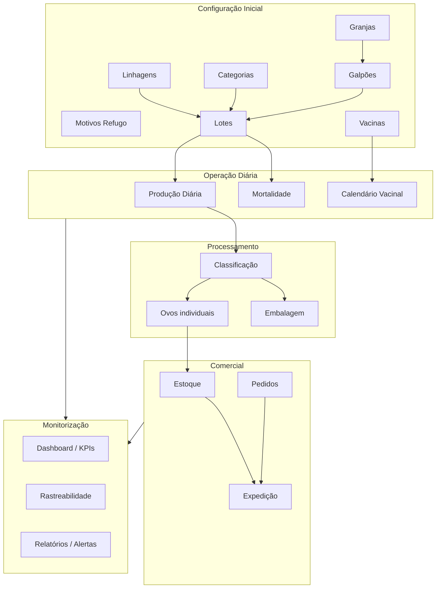

# Módulo de Produção Avícola (Ovos)

Documentação do que foi implementado no sistema **Laravel + Vue.js**, incluindo rotas, estrutura de ficheiros e **fluxo operacional recomendado** para registo de dados.

---

## 1. Visão geral da arquitetura

| Camada | Tecnologia | Localização |
|--------|------------|-------------|
| Backend API | Laravel | `app/Http/Controllers/EggManagement/` |
| Modelos | Eloquent | `app/Models/EggModule/` e `app/Models/RejectReason.php` |
| Migrações | Laravel | `database/migrations/2026_06_13_*` e `2026_06_18_*` |
| Frontend | Vue 3 + Vue Router | `resources/js/pages/admin/egg-module/` |
| Rotas Vue | Vue Router | `resources/js/routes.js` |
| Rotas API | Laravel | `routes/web.php` (prefixo `/admin/`) |
| Menu lateral | Blade | `resources/views/admin/layouts/app.blade.php` |

### Padrão dos ecrãs CRUD

A maioria dos módulos segue o mesmo padrão:

- **Index** — listagem com pesquisa, paginação e eliminação
- **Create** — formulário de criação (vee-validate + yup + axios)
- **Show** — detalhe do registo
- **Edit** — edição do registo

Componentes em `resources/js/pages/admin/egg-module/<pasta>/`.

---

## 2. Mapa do menu (interface)

### Gestão de Ovos

| Menu | Rota Vue |
|------|----------|
| Farmas | `/admin/granjas` |
| Galpões | `/admin/galpoes` |
| Lotes | `/admin/lotes` |
| Linhagens | `/admin/linhagens` |
| Produção Diária | `/admin/producao-diaria` |
| Mortalidade | `/admin/mortalidade` |
| Calendário Vacinal | `/admin/calendario-vacinal` |
| Classificação de Ovos | `/admin/classificacao-ovos` |
| Ovos | `/admin/ovos` |
| Embalagem | `/admin/embalagem` |
| Estoque de Ovos | `/admin/estoque-ovos` |
| Pedidos | `/admin/pedidos` |
| Expedição | `/admin/expedicao-ovos` |
| Rastreabilidade | `/admin/rastreabilidade` |
| Dashboard Ovos | `/admin/dashboard-ovos` |

### Indicadores Avícolas (KPIs)

| Menu | Rota Vue |
|------|----------|
| KPIs de Postura | `/admin/kpi-postura` |
| Taxa de Mortalidade | `/admin/kpi-mortalidade` |
| Conversão Alimentar | `/admin/kpi-conversao` |
| Curva de Postura | `/admin/curva-postura` |
| Ranking de Galpões | `/admin/ranking-galpoes` |
| Custo por Dúzia | `/admin/custo-duzia` |

### Relatórios Ovos

| Menu | Rota Vue |
|------|----------|
| Relatório Produção Diária | `/admin/relatorio-producao-diaria` |
| Relatório de Refugos | `/admin/relatorio-refugos` |
| Relatório Estoque Ovos | `/admin/relatorio-estoque-ovos` |
| Relatório Sanitário | `/admin/relatorio-sanitario` |
| Relatório Rastreabilidade | `/admin/relatorio-rastreabilidade` |

### Configurações Avícolas

| Menu | Rota Vue |
|------|----------|
| Linhagens | `/admin/linhagens` |
| Categorias de Ovos | `/admin/categorias-ovos` |
| Motivos de Refugo | `/admin/motivos-refugo` |
| Vacinas | `/admin/vacinas` |
| Alertas | `/admin/alertas-ovos` |

---

## 3. Módulos implementados (detalhe)

### 3.1 Estrutura base (granja → lote)

| Módulo | Rota Vue | API | Pasta Vue |
|--------|----------|-----|-----------|
| Granjas (Farmas) | `/admin/granjas` | `/admin/farms` | `farms/` |
| Galpões | `/admin/galpoes` | `/admin/houses` | `houses/` |
| Linhagens | `/admin/linhagens` | `/admin/lineages` | `lineages/` |
| Lotes | `/admin/lotes` | `/admin/flocks` | `flocks/` |

**Campos principais**

- **Granja:** nome, localização, NIF, contacto, estado ativo
- **Galpão:** granja, nome, capacidade, caixas, automação, código
- **Linhagem:** nome, fornecedor, características da raça
- **Lote:** galpão, linhagem, código, datas, aves iniciais/atuais, estado (`growing` / `laying` / `disposed`)

**APIs auxiliares:** `farms-all`, `houses-all`, `lineages-all`, `flocks-all`, `flocks-active`

---

### 3.2 Produção e sanidade

| Módulo | Rota Vue | API | Pasta Vue |
|--------|----------|-----|-----------|
| Produção Diária | `/admin/producao-diaria` | `/admin/daily-production` | `daily-production/` |
| Mortalidade | `/admin/mortalidade` | `/admin/mortality` | `mortality/` |
| Vacinas | `/admin/vacinas` | `/admin/vaccines` | `vaccines/` |
| Calendário Vacinal | `/admin/calendario-vacinal` | `/admin/vaccination-schedule` | `vaccination-schedule/` |

**Produção diária:** lote, data, total de ovos, rachados/sujos/deformados, ração, água, horas de luz.

**Mortalidade:** ao registar, o sistema reduz `current_bird_count` do lote.

**Calendário vacinal:** agendar, aplicar ou cancelar vacinação; estados `pending` / `applied` / `canceled`.

---

### 3.3 Configuração de ovos

| Módulo | Rota Vue | API | Pasta Vue |
|--------|----------|-----|-----------|
| Categorias de Ovos | `/admin/categorias-ovos` | `/admin/egg-categories` | `egg-categories/` |
| Motivos de Refugo | `/admin/motivos-refugo` | `/admin/reject-reasons` | `reject-reasons/` |

**Categorias:** nome, peso mín./máx. (g), ativo/inativo.

**Motivos de refugo:** nome, descrição, ativo/inativo — usados no registo de ovos.

**APIs auxiliares:** `egg-categories-all`, `reject-reasons-all`

---

### 3.4 Classificação, ovos e embalagem

| Módulo | Rota Vue | API | Pasta Vue |
|--------|----------|-----|-----------|
| Classificação de Ovos | `/admin/classificacao-ovos` | `/admin/egg-classifications` | `egg-classifications/` |
| Ovos (individuais) | `/admin/ovos` | `/admin/eggs` | `eggs/` |
| Embalagem | `/admin/embalagem` | `/admin/packaging` | `packaging/` |

**Classificação:** processamento por lote (ovos lavados/não lavados, refugos, % refugo).

**Ovos:** código de rastreio gerado automaticamente (`EGG-...`), lote, data de postura, qualidade, destino, motivo de refugo.

**Embalagem:** ligação à classificação, tipo (`tray` / `box`), quantidades, validade, QR code gerado no backend.

**APIs auxiliares:** `eggs-all`, `egg-classifications-all`

---

### 3.5 Estoque, pedidos e expedição

| Módulo | Rota Vue | API | Pasta Vue |
|--------|----------|-----|-----------|
| Estoque de Ovos | `/admin/estoque-ovos` | `/admin/egg-inventory` | `egg-inventory/` |
| Pedidos | `/admin/pedidos` | `/admin/egg-orders` | `egg-orders/` |
| Expedição | `/admin/expedicao-ovos` | `/admin/egg-shipping` | `egg-shipping/` |

**Estoque:** ovo + galpão + quantidade + data entrada + localização; estados `available` / `reserved` / `shipped`. Ações: reservar e libertar stock.

**Pedidos:** cliente, categoria, dúzias, preço; fluxo de estados:
`pending` → `approved` → `picked` → `shipped` (ou `canceled`).

**Expedição:** liga pedido (em estado *Separado*) + estoque FIFO; atualiza pedido para `shipped` e estoque para `shipped`.

**APIs auxiliares:** `egg-inventory/fifo-list`, `egg-inventory/stock-alerts`, `egg-orders/pending-orders`

---

### 3.6 Rastreabilidade, dashboard e alertas

| Módulo | Rota Vue | API | Pasta Vue |
|--------|----------|-----|-----------|
| Rastreabilidade | `/admin/rastreabilidade` | `/admin/traceability` | `traceability/` |
| Detalhe rastreio | `/admin/rastreabilidade/detalhe/:code` | `/admin/traceability/search` | `traceability/` |
| Dashboard Ovos | `/admin/dashboard-ovos` | `/admin/egg-dashboard` | `dashboard/` |
| Alertas | `/admin/alertas-ovos` | `/admin/egg-alerts` | `egg-alerts/` |

**Rastreabilidade:** pesquisa por código de ovo ou QR de embalagem; cadeia granja → galpão → lote → classificação → estoque.

**Dashboard:** KPIs do dia (produção, mortalidade, estoque, pedidos), gráficos/tabelas dos últimos 14 dias.

**Alertas:** tipos `laying`, `mortality`, `inventory`, `expiry`, `vaccine`; estados `sent` / `read` / `resolved`.

---

### 3.7 KPIs (indicadores)

| Página | API |
|--------|-----|
| KPIs de Postura | `GET /admin/egg-kpis/laying-rate` |
| Taxa de Mortalidade | `GET /admin/egg-kpis/mortality-rate` |
| Conversão Alimentar | `GET /admin/egg-kpis/feed-conversion` |
| Curva de Postura | `GET /admin/egg-kpis/laying-curve?flock_id=` |
| Ranking de Galpões | `GET /admin/egg-kpis/house-ranking` |
| Custo por Dúzia | `GET /admin/egg-kpis/cost-per-dozen` |

Pasta Vue: `kpis/`

---

### 3.8 Relatórios

| Página | API |
|--------|-----|
| Produção Diária | `GET /admin/egg-reports/daily-production` |
| Refugos | `GET /admin/egg-reports/rejects` |
| Estoque Ovos | `GET /admin/egg-reports/inventory` |
| Sanitário | `GET /admin/egg-reports/sanitary` |
| Rastreabilidade | `GET /admin/egg-reports/traceability` |
| Exportação | `GET /admin/egg-reports/export-excel/{report}` |

Pasta Vue: `reports/`

Relatórios adicionais na API (sem menu): `vaccination`, `financial`.

---

## 4. Fluxo operacional recomendado

Este é o **ordem sugerida** para configurar o sistema e registar operações do dia a dia.

### Fase A — Configuração inicial (uma vez)

```
1. Linhagens          → /admin/linhagens
2. Categorias de Ovos → /admin/categorias-ovos
3. Motivos de Refugo  → /admin/motivos-refugo
4. Vacinas            → /admin/vacinas
5. Granjas            → /admin/granjas
6. Galpões            → /admin/galpoes
7. Lotes              → /admin/lotes
```

**Dependências:** galpão precisa de granja; lote precisa de galpão + linhagem.

---

### Fase B — Operação diária na granja

```
┌─────────────────────────────────────────────────────────────┐
│  MANHÃ / TURNO                                              │
├─────────────────────────────────────────────────────────────┤
│  1. Produção Diária    → registar ovos do dia por lote      │
│  2. Mortalidade        → registar mortes (se houver)        │
│  3. Calendário Vacinal → aplicar vacinas pendentes          │
└─────────────────────────────────────────────────────────────┘
```

**Produção Diária** (`/admin/producao-diaria/create`):

1. Selecionar lote (apenas lotes em postura)
2. Informar data, total de ovos, refugos do dia
3. Opcional: ração, água, horas de luz

**Mortalidade** (`/admin/mortalidade/create`):

1. Selecionar lote, data, quantidade, causa provável

**Calendário Vacinal** (`/admin/calendario-vacinal`):

1. Ver pendentes do dia
2. Na ficha do agendamento: **Aplicar** ou **Cancelar**

---

### Fase C — Processamento e classificação de ovos

```
┌─────────────────────────────────────────────────────────────┐
│  PROCESSAMENTO                                              │
├─────────────────────────────────────────────────────────────┤
│  1. Classificação de Ovos  → processamento do lote/dia      │
│  2. Ovos                   → registo individual (rastreio)  │
│  3. Embalagem              → bandejas/caixas + QR           │
└─────────────────────────────────────────────────────────────┘
```

**Classificação** (`/admin/classificacao-ovos/create`):

1. Lote, data de processamento, ovos lavados/não lavados, refugos

**Ovos** (`/admin/ovos/create`):

1. Lote, data postura, qualidade, destino
2. Motivo de refugo (se aplicável)
3. O sistema gera o **código de rastreio** automaticamente

**Embalagem** (`/admin/embalagem/create`):

1. Selecionar classificação existente
2. Tipo (bandeja/caixa), quantidades, validade
3. QR code gerado no registo; pode regenerar na ficha de detalhe

---

### Fase D — Estoque e comercialização

```
┌─────────────────────────────────────────────────────────────┐
│  ESTOQUE → VENDA → EXPEDIÇÃO                                │
├─────────────────────────────────────────────────────────────┤
│  1. Estoque de Ovos  → entrada (ovo + galpão + qtd)         │
│  2. Pedidos          → criar pedido do cliente              │
│  3. Pedidos          → Aprovar → Separar                    │
│  4. Expedição        → ligar pedido + estoque (FIFO)        │
└─────────────────────────────────────────────────────────────┘
```

**Estoque** (`/admin/estoque-ovos/create`):

1. Selecionar ovo (lista de ovos registados)
2. Galpão, quantidade, data entrada, localização
3. Na ficha: **Reservar** ou **Libertar** stock

**Pedidos** (`/admin/pedidos/create` → `/admin/pedidos/:id`):

| Passo | Ação na interface | Estado resultante |
|-------|-------------------|-------------------|
| Criar pedido | Formulário com cliente, categoria, dúzias | `pending` |
| Aprovar | Botão na ficha | `approved` |
| Separar | Botão na ficha | `picked` |
| Cancelar | Botão (se ainda não expedido) | `canceled` |

**Expedição** (`/admin/expedicao-ovos/create`):

1. Pedido deve estar em estado **Separado** (`picked`)
2. Selecionar stock disponível (lista FIFO)
3. Preencher transportadora, motorista, matrícula, fatura
4. Ao gravar: pedido → `shipped`, estoque → `shipped`

---

### Fase E — Monitorização

```
Dashboard Ovos     → visão geral do dia
KPIs               → análise de desempenho por período
Rastreabilidade    → pesquisa por código ou QR
Alertas            → notificações do sistema
Relatórios         → exportação e análise histórica
```

---

## 5. Diagrama do fluxo completo



---

## 6. Estados importantes (referência rápida)

### Lote (`flocks.status`)

| Valor | Significado |
|-------|-------------|
| `growing` | Recria |
| `laying` | Postura |
| `disposed` | Descartado |

### Ovo — qualidade (`eggs.quality`)

`clean` · `dirty` · `cracked` · `deformed`

### Ovo — destino (`eggs.destination`)

`packaged` · `reject` · `broken`

### Estoque (`egg_inventories.status`)

`available` · `reserved` · `shipped`

### Pedido (`egg_orders.status`)

`pending` → `approved` → `picked` → `shipped` | `canceled`

### Alerta (`egg_alerts.status`)

`sent` → `read` → `resolved`

---

## 7. Endpoints auxiliares (dropdowns)

Usados pelos formulários Vue para popular selects:

| Endpoint | Uso |
|----------|-----|
| `GET /admin/farms-all` | Granjas ativas |
| `GET /admin/houses-all` | Galpões ativos |
| `GET /admin/lineages-all` | Linhagens ativas |
| `GET /admin/flocks-all` | Lotes (produção diária) |
| `GET /admin/flocks-active` | Lotes recria + postura |
| `GET /admin/vaccines-all` | Vacinas |
| `GET /admin/egg-categories-all` | Categorias ativas |
| `GET /admin/reject-reasons-all` | Motivos de refugo ativos |
| `GET /admin/eggs-all` | Ovos para estoque |
| `GET /admin/egg-classifications-all` | Classificações para embalagem |
| `GET /admin/egg-inventory/fifo-list` | Estoque FIFO para expedição |
| `GET /admin/egg-orders/pending-orders` | Pedidos em aberto |

---

## 8. Estrutura de ficheiros Vue

```
resources/js/pages/admin/egg-module/
├── farms/                  # Granjas
├── houses/                 # Galpões
├── lineages/               # Linhagens
├── flocks/                 # Lotes
├── daily-production/         # Produção diária
├── mortality/              # Mortalidade
├── vaccines/               # Vacinas
├── vaccination-schedule/   # Calendário vacinal
├── egg-categories/         # Categorias de ovos
├── reject-reasons/         # Motivos de refugo
├── egg-classifications/    # Classificação
├── eggs/                   # Ovos individuais
├── packaging/              # Embalagem
├── egg-inventory/          # Estoque
├── egg-orders/             # Pedidos
├── egg-shipping/           # Expedição
├── traceability/           # Rastreabilidade
├── dashboard/              # Dashboard
├── egg-alerts/             # Alertas
├── kpis/                   # Indicadores
└── reports/                # Relatórios
```

---

## 9. Migrações principais

| Tabela | Ficheiro de migração |
|--------|----------------------|
| `farms` | `2026_06_13_092908_create_farms_table` |
| `houses` | `2026_06_13_092932_create_houses_table` |
| `lineages` | `2026_06_13_092940_create_lineages_table` |
| `flocks` | `2026_06_13_092945_create_flocks_table` |
| `daily_productions` | `2026_06_13_092956_create_daily_productions_table` |
| `mortalities` | `2026_06_13_093006_create_mortalities_table` |
| `vaccines` | `2026_06_13_093014_create_vaccines_table` |
| `vaccine_schedules` | `2026_06_13_093028_create_vaccine_schedules_table` |
| `egg_categories` | `2026_06_13_093037_create_egg_categories_table` |
| `egg_classifications` | `2026_06_13_093044_create_egg_classifications_table` |
| `eggs` | `2026_06_13_093051_create_eggs_table` |
| `packings` | `2026_06_13_093057_create_packings_table` |
| `egg_inventories` | `2026_06_13_093107_create_egg_inventories_table` |
| `egg_orders` | `2026_06_13_093426_create_egg_orders_table` |
| `egg_shippings` | `2026_06_13_093434_create_egg_shippings_table` |
| `egg_alerts` | `2026_06_13_093441_create_egg_alerts_table` |
| `reject_reasons` | `2026_06_18_113335_create_reject_reasons_table` |

---

## 10. Notas técnicas

1. **Autenticação:** todas as rotas API estão no grupo `admin` com middleware de autenticação.
2. **Paginação:** listagens usam 15 registos por página (Laravel paginate).
3. **Validação frontend:** vee-validate + yup; erros do backend são exibidos via toastr.
4. **Exportação de relatórios:** formato JSON via `export-excel/{report}` (PDF planeado na API mas devolve JSON).
5. **Show do lote** (`ShowFlocks.vue`): inclui links para produção, mortalidade e calendário vacinal do lote.

---

## 11. Checklist rápido — primeiro dia de uso

- [ ] Criar pelo menos 1 linhagem, categoria e motivo de refugo
- [ ] Criar granja e galpão
- [ ] Criar lote em estado `laying` (postura)
- [ ] Registar produção diária do dia
- [ ] (Opcional) Registar classificação e ovos
- [ ] (Opcional) Entrada no estoque
- [ ] Verificar dashboard em `/admin/dashboard-ovos`

---

*Documento gerado com base na implementação do módulo Produção Avícola no repositório danaplace.*
